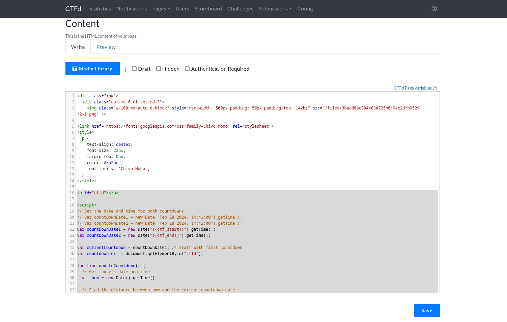

# A simple countdown script for CTFd

### This script displays a countdown timer and loops between two provided dates, indicating whether it's counting down to the start or end of a CTF event. 

Here's a breakdown of its functionality:

1. The script defines two variables, countDownDate1 and countDownDate2, which are set to the start and end dates of the CTF event using placeholder values ({{ctf_start}} and {{ctf_end}}).

2. If the time is remaining:
        The remaining time is displayed in the format "Xd Yh Xm Xs" (days, hours, minutes, seconds) if days is greater than 0, otherwise only hours, minutes, and seconds are shown.
3. If meaning the countdown has passed:
        The message "Wait for the next announcement!" is displayed.

### Overall, this script continuously displays a countdown timer for the CTF event, switching between the start and end dates, and showing a message when the current countdown has ended.



```
<!-- CTFd countdown start -->
<h5 class="text-center">
<p id="ctfd"></p>
  // Page refresh in 59 seconds to update changes in time settings. Remove if not required.
<meta http-equiv="refresh" content="59" />
<script>
  // Set the date and time for both countdowns
  var countDownDate1 = new Date("{{ctf_start}}").getTime();
  var countDownDate2 = new Date("{{ctf_end}}").getTime();
  var currentCountdown = countDownDate1; // Start with first countdown
  var countdownText = document.getElementById("ctfd");

  function updateCountdown() {
    // Get today's date and time
    var now = new Date().getTime();
    
    // Find the distance between now and the current countdown date
    var distance = currentCountdown - now;
    
    // Time calculations for days, hours, minutes, and seconds
    var days = Math.floor(distance / (1000 * 60 * 60 * 24));
    var hours = Math.floor((distance % (1000 * 60 * 60 * 24)) / (1000 * 60 * 60));
    var minutes = Math.floor((distance % (1000 * 60 * 60)) / (1000 * 60));
    var seconds = Math.floor((distance % (1000 * 60)) / 1000);
    
    // Output the result with additional text based on current countdown
    var countdownPrefix = (currentCountdown === countDownDate1) ? "CTF will start in " : "CTF will end in ";
    
    if (distance > 0) {
      // Display normal countdown if time is positive
      if (days > 0) {
        countdownText.textContent = countdownPrefix + `${days} days ${hours}h ${minutes}m ${seconds}s`;
      } else {
        countdownText.textContent = countdownPrefix + `${hours}h ${minutes}m ${seconds}s`;
      }
    } else {
      // Show message when countdown is negative
      countdownText.textContent = "Wait for the next announcement!";
      
      // Switch to the other countdown immediately after displaying the message
      currentCountdown = (currentCountdown === countDownDate1) ? countDownDate2 : countDownDate1;
    }
  }

  // Update the countdown every 1 second
  var x = setInterval(updateCountdown, 1000);
</script>
<!-- CTFd countdown end -->

```
